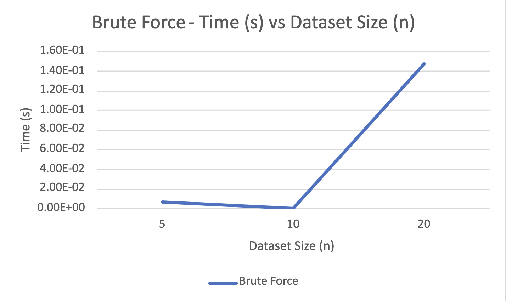
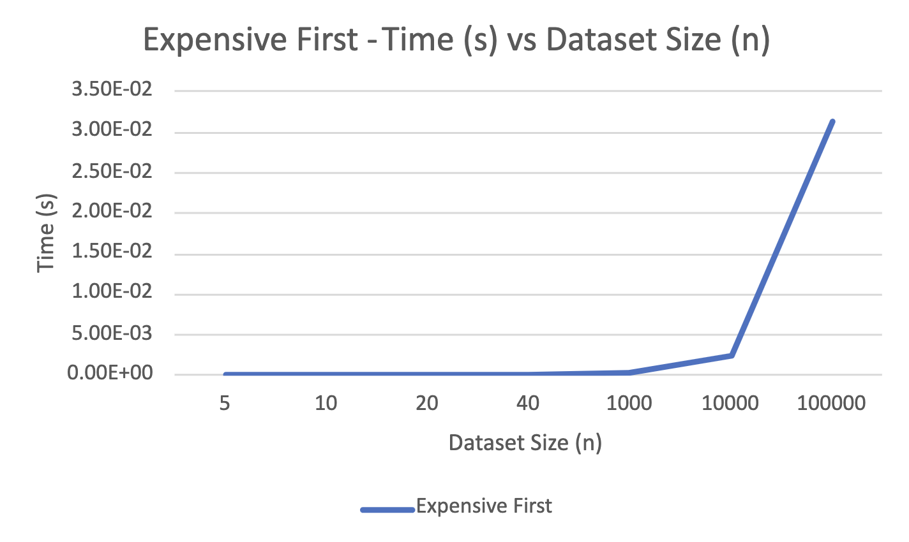
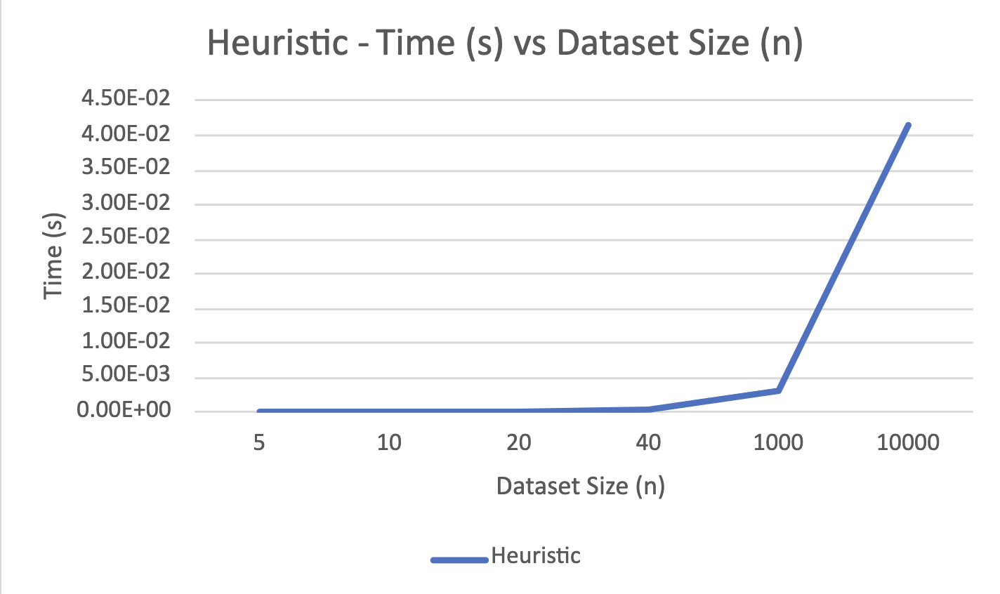
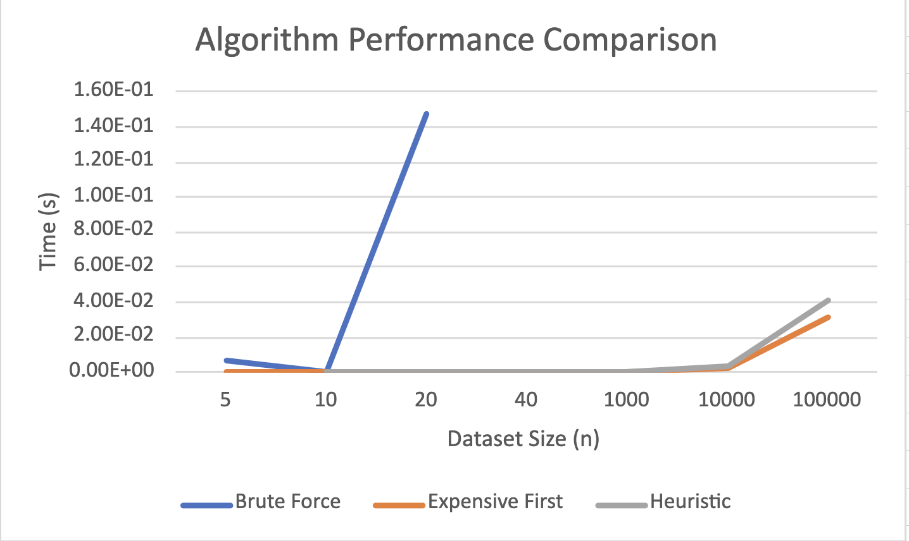

# 22s-pa01-material-gworls

# Welcome!

Summary:
----
Our repository contains our first project for CS3353, Fundamentals of Algorithms. The task is to create 
three different algorithms to address one key issue: optimization. Given a dataset of "paintings" of varying 
sizes and prices, we were asked to code a brute force algorithm (to address a variation of the Traveling Salesman 
Problem), an "Expensive-First" algorithm to sort the paintings in descending order by value and use that to find the 
most valuable combination, and a heuristic algorithm to find the optimal solution (key word: _optimal_,
not best). In the rest of the README, we will address how to run this program as well as our takeways and analysis on 
the results produced.

How to Run Our Program:
------
To run our program, you will only need _**one**_ program argument. The program argument is simply the file path to the 
input/data file that you want to use for the algorithms.

### Running from Terminal (MacOS):
To run from terminal using MacOS, you need to follow these steps - 
1. cd into the project directory
2. mkdir build
3. cd build
4. cmake .. (if that doesn't work, cmake3 .. should)
5. make 22s-pa01-material-gworls
6. ./22s-pa01-material-gworls [FILE PATH]

### Running from Terminal (Windows):
To run from terminal using Windows, you need to follow these steps - 
1. cd into the src directory of the project. This is where the .cpp files are located.
2. If you have the GCC C++ compiler installed, you can run "g++ -o myprogram main.cpp algos.cpp manager.cpp painting.cpp"
3. run "myprogram.exe *your-input-file-path*" where you replace "*your-input-file-path*" with the path to your input file.

**NOTE:** If you are on Mac, you can put the absolute path of the file path. 
However, Windows has issues using absolute paths, so you will most likely need 
to use a path that is relative to your project directory. If the relative path doesn't work for you,
try an absolute path. 

Sample Input:
------------
### Input Example for Size 5

1024 768

5

1 4695 883 645

2 4882 665 476

3 7343 474 26

4 5662 289 281

5 3896 764 211

NOTES: 
- The first line has two integers separated by a space that represent the length and height of the wall, respectively.
- The second line has a single integer that represents the number of paintings in this input file.
- The rest of the lines contain an integer for painting ID, a second integer for the value of the painting, a third integer representing the 
painting width, and a fourth integer representing the painting height. 

### Output Example for Size 5

13006

3 7344 474 26

4 5662 289 281

NOTES:
- The first line has a single integer representing the cumulative value of the subset listed.
- The rest of the lines contain identify information as listed above in the "Input Example" section to identify
which paintings are in this subset.

Our Approach:
------------
### Brute Force - 
For Brute Force, we generated all the possible subsets of the set of paintings that fit the size requirements and compared the
total value of that subset to a "Maximum Value" found thus far. If the value of that subset was greater than the maximum value 
thus far, then we'd store that subset as the "Best Combination" thus far. Once we run through all combinations
that meet the size requirements, we return the "Best Combination" as the result of our brute force algorithm.
Unfortunately, because we generate all possible subsets, the brute force algorithm cannot be reasonably expected to solve
for the best combination for input sizes greater than 20. 

### Expensive First - 
For Expensive First, we took a rather simple approach. First, we QuickSort the entire 
dataset of paintings by price. Then, we call a function called determineLayout, where we 
fit the paintings to the wall. If a painting doesn't fit on the wall, it's skipped and the 
other paintings are checked until no more paintings fit on the wall.

### Heuristic - 
Our approach for the Heuristic was to post-optimize. We first went through the dataset and 
grouped the paintings into their own "walls". Then, we calculated which walls were the most "expensive" 
and stored the Top 3 "Most-Expensive" walls. From there, we QuickSorted the paintings on those walls from most 
to least expensive. Why? Our thought process was that the wall with the highest value will most likely contain low 
value paintings whereas the second- and third-highest value walls will contain some high-value paintings. So, our 
logic was to compare the least-expensive paintings from the first wall to the most-expensive paintings from the other 
two walls. If the paintings from the latter were higher in value **and** fit on the wall, we would make the switch 
between the two. At the end, we would have the most _optimal_ solution.

Important Things to Note:
-------------
There are a few _very_ important things to note whenever running our program:
- Our Brute Force algorithm will **NOT** work with datasets above a size of 20.
- Our heuristic algorithm will **NOT** work with datasets below a size of 10. If it does, the net size of the paintings in the dataset need to be able to cover at least three different walls (Reasoning explained in the 'Our Approach' portion of the README).
- Our output files will be produced in the input file folder. So, if you are running this program locally (not through Github), you will find the output there.

Our Graphs & Related Data:
-----------
NOTE: "n" represents the number of "paintings" in the input file.
### **Brute Force Algorithm:**

### **Expensive First Algorithm:**

### **Heuristic Algorithm:**

### **Brute Force vs Expensive First vs Heuristic:**

To view our excel spreadsheet containing our specific data, please click 
**<a href="https://smu365-my.sharepoint.com/:x:/g/personal/smurillosanchez_smu_edu/EVvjnv6-C_5MmCJvXMpyOAcBaOErMcn3R5NtXW8GbeA8yA?e=r7eIjj" target="_blank">here</a>**.
(**NOTE:** Before clicking the link, please make sure that you are signed into your SMU email.)

Our Conclusions and Key Takeaways:
----------
Before we started coding our algorithms, we did a lot of research on Brute Force and Heuristic algorithms. 
We found that Brute Force is highly inefficient for problems like this one, which our results/data reflect. 
In terms of heuristic algorithms, many articles highlighted that heuristic algorithms produce only an optimal solution, 
and not necessarily the best solution. After looking at our data, it was interesting to see that our heuristic and 
most-expensive algorithms had highly similar efficiencies.

Perhaps we did not produce the absolute optimal solution, but its efficiency and ability to produce a value close to 
most-expensive show that we did, in fact, produce an optimal solution through our heuristic algorithm.

### **Sources:** ###

- https://medium.com/opex-analytics/heuristics-in-optimization-41c842888ec8
- https://medium.com/opex-analytics/heuristic-algorithms-for-the-traveling-salesman-problem-6a53d8143584https://optimization.mccormick.northwestern.edu/index.php/Heuristic_algorithms#Swarm_Intelligence
- https://codereview.stackexchange.com/questions/231696/brute-force-algorithm-in-c
- https://stackoverflow.com/questions/45423562/creating-a-brute-force-algorithm-in-c
- https://medium.com/opex-analytics/heuristic-algorithms-for-the-traveling-salesman-problem-6a53d8143584
- https://optimization.mccormick.northwestern.edu/index.php/Heuristic_algorithms
- https://www.tutorialspoint.com/How-to-compile-and-run-the-Cplusplus-program

22s-pa01-material-gworls created by GitHub Classroom
